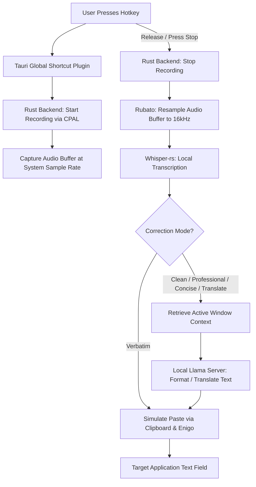

<div align="center">
  

  <h1>Draftmic</h1>

  <p><strong>Local, Context-Aware Audio Dictation & Intelligent Text-Formatting Assistant</strong></p>

  <p>
    <a href="#key-features">Features</a> •
    <a href="#how-it-works-architecture">Architecture</a> •
    <a href="#getting-started">Installation</a> •
    <a href="#configuration">Docs</a>
  </p>

  <p>
    <a href="https://tauri.app/"></a>
    <a href="https://react.dev/"></a>
    <a href="https://www.rust-lang.org/"></a>
    <a href="https://www.typescriptlang.org/"></a>
    <a href="LICENSE"></a>
  </p>
</div>

---

## 🌟 Why Draftmic?

Most voice dictation tools either rely on expensive, privacy-invasive cloud APIs or lack the intelligence to properly format your speech for different contexts. 

**Draftmic** solves this by running entirely on your local machine. It captures your voice using a local **Whisper** model, reads the context of the application you are typing in, and uses a local **Llama** model to format your text perfectly before automatically pasting it into your active window. No cloud dependencies, no API keys, and your data never leaves your device.

---

## ✨ Key Features

Draftmic is packed with powerful, privacy-first features designed to integrate seamlessly into your workflow:

- 🎙️ **Local-First Audio Transcription**: Uses `whisper-rs` (Rust bindings for `whisper.cpp`) to run transcription entirely on-device.
- 🧠 **Context-Aware Formatting**: Reads your active window (e.g., *Slack*, *VS Code*, *Gmail*) via `active_win_pos_rs` and tailors the LLM's writing style to match the context.
- 🚀 **GPU Acceleration & Smart Fallback**: Automatically leverages CUDA, Vulkan, or Metal. If GPU loading fails, it seamlessly falls back to physical CPU cores.
- 🤖 **Background Llama Server**: Automatically spawns and manages a local `llama-server` process (port `42837`) for post-processing and formatting.
- 📋 **Auto-Paste & Keyboard Simulation**: Directly injects the final formatted text into your active text field using `enigo` and `arboard`. No manual copying required.
- 🗄️ **Offline Persistent Storage**: Maintains a secure, local history of your transcriptions (including duration, word count, and app context) using Zustand persist.
- 📥 **Built-in Model Manager**: In-app downloader to securely fetch Hugging Face `.gguf` and `.bin` models, complete with real-time download progress and speed visualizers.
- 🌍 **Multilingual Auto-Detect**: Automatically detects the spoken language from your keyboard layout or audio, supporting over 60+ localized languages natively.
- ⚙️ **Deep OS Integration**: Supports "Launch at Login" and provides native audio sound-effect feedback for seamless daily usage.
- 📱 **Overlay HUD Widget**: A transparent, fullscreen click-through overlay showing real-time audio amplitude waveforms and processing status.

### Four Correction Modes
Draftmic intelligently transforms your raw speech based on your active mode:
1. **Verbatim**: Skips LLM processing entirely, pasting the raw Whisper transcript directly.
2. **Clean**: Removes stutters, filler words (*um, uh, like*), and minor grammatical slips while keeping the original wording intact.
3. **Professional**: Formats and rephrases speech to be polished, structured, formal, and business-ready.
4. **Concise**: Condenses dictated speech into brief, action-oriented bullet points or summaries.

---

## 🏗️ How It Works (Architecture)



---

## 🚀 Getting Started

### Prerequisites
To build and compile Draftmic locally, you will need:
- **Rust toolchain** (stable, 2021 edition): [Install Rust](https://www.rust-lang.org/tools/install)
- **Node.js** (v18+) and **npm**: [Install Node.js](https://nodejs.org/)
- **C++ Compiler Tools** (Windows Build Tools / Xcode Command Line Tools)

### Development Setup

1. **Clone the Repository**:
   ```bash
   git clone https://github.com/ron54317/Draftmic.git
   cd Draftmic/DraftmicAPP
   ```

2. **Install JavaScript Dependencies**:
   ```bash
   npm install
   ```

3. **Provide Llama-Server Executable**:
   Download the compiled `llama-server` for your OS from the [llama.cpp releases](https://github.com/ggerganov/llama.cpp/releases) and place it under:
   ```path
   src-tauri/resources/bin/llama-server
   ```
   *(On Windows, ensure it is named `llama-server-x86_64-pc-windows-msvc.exe` or `llama-server.exe`)*

4. **Run in Development Mode**:
   ```bash
   npm run dev
   ```
   This will spin up the Vite development server and launch the Tauri window. The onboarding flow will assist you in downloading both the Whisper (`.bin`) and Llama (`.gguf`) models directly.

---

## 🛠️ Build & Packaging

To compile a production build of Draftmic:

```bash
npm run build
npm run tauri build
```
The output installer packages (e.g., `.msi`, `.dmg`, `.AppImage`) will be generated in `src-tauri/target/release/bundle/`.

### Helper Scripts
The repository contains auxiliary utility scripts for production packaging:
- **`trim_logo.mjs`**: Automatically trims transparent edges from `public/LogoNobackround.png` and extends it into a padded square layout using `sharp`.
- **`generate_wix_images.cjs` / `gen_wix.py`**: Generates custom `WixDialog.bmp` and `WixBanner.bmp` assets, which are compiled directly into the WiX MSI installer during Windows packaging.

---

## ⚙️ Configuration & Hotkeys

All configuration is persisted locally. Important properties include:

| Action | Default Hotkey | Description |
|---|---|---|
| **Dictate** | `Cmd/Ctrl + Shift + Space` | Toggle standard dictation on/off. |
| **Push-to-Talk (PTT)** | `Alt + Space` | Hold to record, release to transcribe & paste. |
| **Translate** | `Cmd/Ctrl + Shift + T` | Toggle live translation to your target language. |
| **Magic** | `Cmd/Ctrl + Shift + M` | Prompt the local LLM directly. |

---

## 🤝 Contributing

We welcome contributions from the community! To submit changes:

1. Fork this repository.
2. Create a feature branch (`git checkout -b feature/amazing-feature`).
3. Commit your changes (`git commit -m 'feat: add amazing feature'`).
4. Push to the branch (`git push origin feature/amazing-feature`).
5. Open a Pull Request.

Please ensure your Rust code is formatted with `cargo fmt` and JavaScript/TypeScript files follow standard conventions.

---

## 📄 License

This project is licensed under the GNU Affero General Public License v3.0. See the [LICENSE](LICENSE) file for more information.

Copyright (c) 2026 Ron Serpik

This program is free software: you can redistribute it and/or modify
it under the terms of the GNU Affero General Public License as
published by the Free Software Foundation, either version 3 of the
License, or (at your option) any later version.

This program is distributed in the hope that it will be useful,
but WITHOUT ANY WARRANTY; without even the implied warranty of
MERCHANTABILITY or FITNESS FOR A PARTICULAR PURPOSE.  See the
GNU Affero General Public License for more details.

> **Privacy Guarantee**: All processing occurs locally. Draftmic does not collect telemetry, transmit voice data, or send text to any third-party services.
